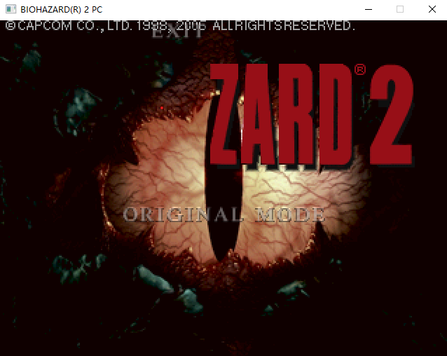
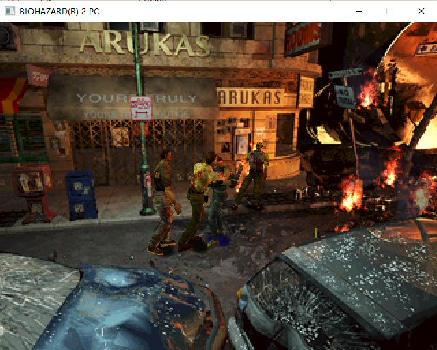

# BioHazard PC 1997 Reverse engineering

Objective: To compile the assembly code so that it can run.

Current status: |>>>-----------------| 15%
* Able to enter the first scene
* The moving animation is strange
* open menu
* Extend functionality using C language

# Depends 

* vs2022 or h
* ddisasm - https://github.com/GrammaTech/ddisasm

# Compiling

Open the `cmd` command line to make the above tool `link/ddisasm` executable.

Run `set > env.txt` in the project directory.

`make` compiles and generates `bio2game/bio2re.exe`.

Other targets in `make` are used to disassemble and generate `main.S`; this is the initial workflow.

# Tool

Install dependencies
`pip install angr pefile treelib`
`pip install git+https://github.com/yanmingsohu/ai-dasm.git`

Check the consistency between the data definition label 
and the source program binary.
`python extract_data_labels.py src/unorganized.S bio2.exe > data_label.txt`
`python extract_data_labels.py src/data.S bio2.exe > data2_label.txt`

Jump table switch structure check report
`python parse_jumptable.py > jumptable.txt`

Converting binary to constant definitions in ASM
`python define_bin.py $L_403df8 01020304ffffffff`

Converting binary to variable reference in ASM
`python define_bin.py $L_403df8 01020304ffffffff -r`

Converting binary from exe file to constant definitions or variable reference
`python define_bin.py -e bio2.exe <Label> <end-address> [-r]`

Snippets from the disassembler
`python dasm.py bio2.exe 0x466350 0x4663d6`

Search for data definitions within functions (and vice versa).
`python defining_contradiction.py > test.txt`

Find floating code
`python defining_contradiction.py -j > floating_code.txt`

Functional Dependency Analyzer
`python defining_contradiction.py -f2 > functions.txt`

Use AI to build function descriptions on a function dependency tree.
`python defining_contradiction.py -f2 FUN_50d9da -ai > functions.txt`

Detect the correspondence between memory addresses and tags in the disassembled data.
`python defining_contradiction.py -bd src\data.S > data_cont.txt`